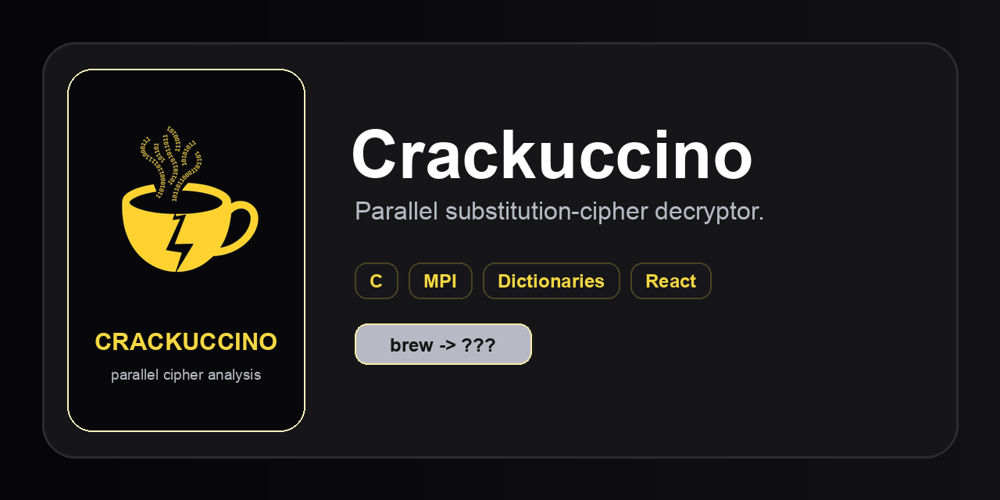

<p align="center">
  
</p>

<p align="center">
  <strong>Parallel substitution-cipher analysis</strong><br>
  Native C, MPI, dictionaries, and live decryption metrics
</p>

<p align="center">
  <a href="https://www.mpi-forum.org/"></a>
  <a href="https://en.wikipedia.org/wiki/Serial_computing"></a>
  <a href="https://en.wikipedia.org/wiki/Dictionary_(data_structure)"></a>
  
  
  
</p>

<p align="center">
  Encrypt plaintext, brute-force substitutions, inspect worker progress, and review valid dictionary matches.
</p>

<p align="center">
  <a href="https://en.cppreference.com/w/c"></a>
  <a href="https://www.open-mpi.org/"></a>
  <a href="https://www.python.org/"></a>
  <a href="https://react.dev/"></a>
  <a href="https://www.typescriptlang.org/"></a>
  <a href="https://tailwindcss.com/"></a>
  <a href="https://vite.dev/"></a>
</p>

<p align="center">
  
</p>

<p align="center">
  
</p>

## Overview

- Encrypt plaintext with a substitution mapping.
- Run serial or distributed MPI brute-force decryption.
- Search bundled or session-only custom dictionaries for valid plaintext candidates.
- Inspect live worker progress, rank status, matches, runtime, and run history.
- Session cookies, origin checks, quotas, and MPI run caps when `CRACKUCCINO_ENV=production`.

Crackuccino supports two decryption paths:

| Mode | Where it appears |
|---|---|
| Known mapping | UI and API direct decrypt; no MPI required |
| MPI search | UI, API runs, and `decrypt-mpi` CLI |
| Serial search | UI, API runs, and `decrypt-serial` CLI |

Bundled dictionaries:

- `brew_dictionary`: themed project dictionary.
- `american_english_dictionary`: larger English word list.
- `small_dictionary`: compact test dictionary.

## Prerequisites

| Dependency | Supported version |
|---|---|
| Python | 3.10+ |
| Node.js | 20.19+, 22.13+, or 24+ |
| npm | 10+ |
| C compiler | GCC or Clang with C11 support |
| MPI | Open MPI with `mpicc` and `mpirun` |
| Docker and Compose | Current stable release for production |

## Quick Start

```bash
./build
```

This installs locked frontend dependencies when needed, builds the native programs and dashboard, and starts the server at `http://127.0.0.1:8010`.

Open MPI may require launching from a normal terminal on macOS.

## Locked Frontend Dependencies

| Package | Version |
|---|---:|
| React / React DOM | 19.2.7 |
| TypeScript | 5.8.3 |
| Tailwind CSS / Tailwind Vite plugin | 4.3.0 |
| Vite | 6.4.3 |
| Floating UI React | 0.27.19 |
| ESLint | 9.39.4 |

## Commands

```bash
./build build       # build native programs and frontend
./build run         # start without rebuilding
./build restart     # rebuild and restart
./build stop        # stop the local server
./build clean       # remove generated output
./build test        # native smoke tests
./build typecheck   # run strict TypeScript checks
./build lint        # run frontend linting
./build audit       # run checks, tests, and dependency audit
./build help        # show command help
```

Set `CRACKUCCINO_PORT` to use a port other than `8010`.
Set `CRACKUCCINO_FULL_TESTS=1` when running `./build test` to include the long MPI and Valgrind benchmark suite.

## Deploy

**Local:** `./build` → `http://127.0.0.1:8010`

**Production**

Set these environment variables on the server:

- `CRACKUCCINO_ENV=production`
- `CRACKUCCINO_SESSION_SECRET` (32+ chars, random)

```bash
docker build -t crackuccino .
docker run -d --restart unless-stopped \
  -e CRACKUCCINO_ENV=production \
  -e CRACKUCCINO_SESSION_SECRET=... \
  crackuccino
```

Serve it through an HTTPS reverse proxy. If multiple app instances are used, configure shared rate limiting at the proxy.

## CLI

Build the native programs first:

```bash
make
```

### Encrypt

```bash
./encrypt "plaintext" [shuffled_mapping]
```

The optional mapping must contain the same unique letters as the plaintext. The command prints the mapping and writes the result to `ciphertext.txt`.

```bash
./encrypt "brew cappuccino"
./encrypt "brew cappuccino" apieocunwbr
```

### Serial Decrypt

```bash
./decrypt-serial <ciphertext_file> <dictionary_file> [-s|--stats]
```

This tries every possible letter mapping on one process. Add `--stats` to show timing and search totals.

```bash
./decrypt-serial ciphertext.txt src/data/dictionaries/brew_dictionary
./decrypt-serial ciphertext.txt src/data/dictionaries/small_dictionary --stats
```

### MPI Decrypt

```bash
mpirun -np <processes> ./decrypt-mpi <ciphertext_file> <dictionary_file> [options]
```

- `-s` or `--stats` shows timing and search totals.
- `-d DEPTH` manually sets the MPI partition depth. The automatic value is usually enough.

```bash
mpirun -np 4 ./decrypt-mpi ciphertext.txt src/data/dictionaries/brew_dictionary
mpirun -np 8 ./decrypt-mpi ciphertext.txt src/data/dictionaries/american_english_dictionary --stats
mpirun -np 4 ./decrypt-mpi ciphertext.txt src/data/dictionaries/small_dictionary -d 2 --stats
```

Use the serial command for smaller searches and MPI when testing parallel performance.

## Project Map

| Path | Purpose |
|---|---|
| `src/native/` | C encryption, serial decryption, and MPI decryption. |
| `src/server/` | Local static server, JSON API, and API reference. |
| `src/frontend/src/` | React application and reusable UI components. |
| `src/frontend/public/assets/` | Functional logos and project report PDF. |
| `src/frontend/dist/` | Generated production frontend; created by `./build build`. |
| `src/data/dictionaries/` | Bundled dictionaries used by the CLI and API. |
| `tests/python/` | Correctness, performance, and memory-safety tests. |

## API Reference

- [`src/server/API.md`](src/server/API.md) documents the local JSON API.

## Notes

Interactive brute force is limited to one billion permutations. Known mappings decrypt directly without MPI. Custom dictionary uploads are bounded, validated, and retained only for the current browser page session.
